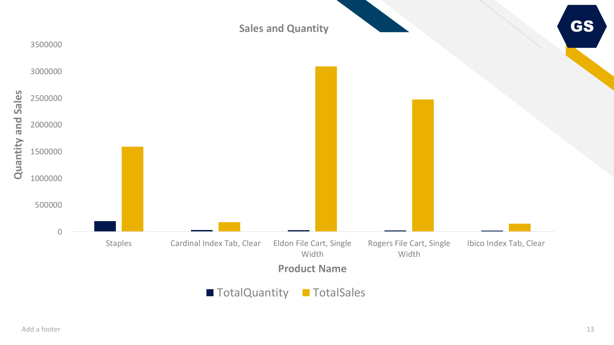
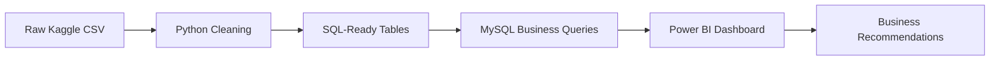
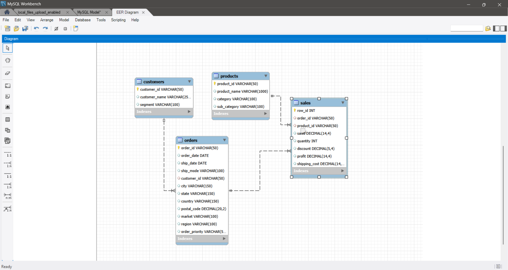
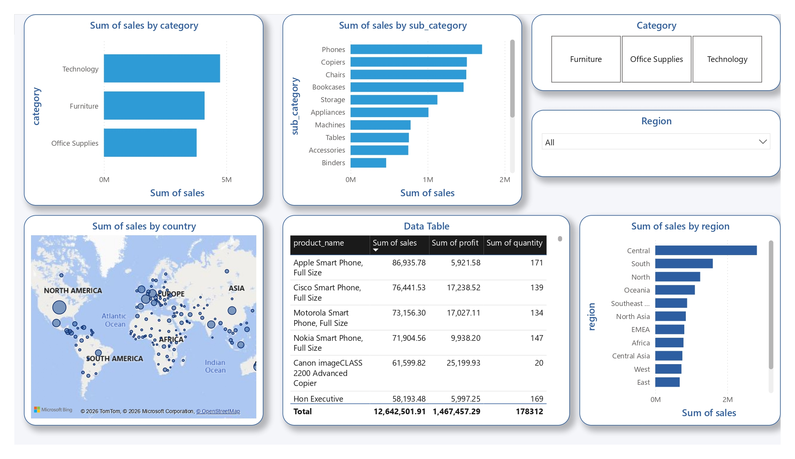
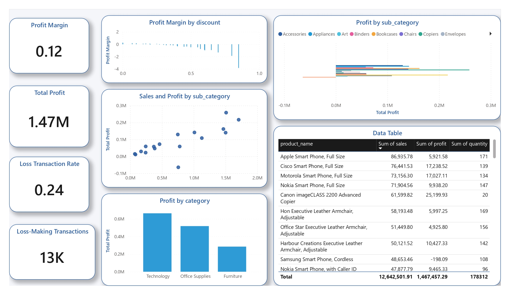
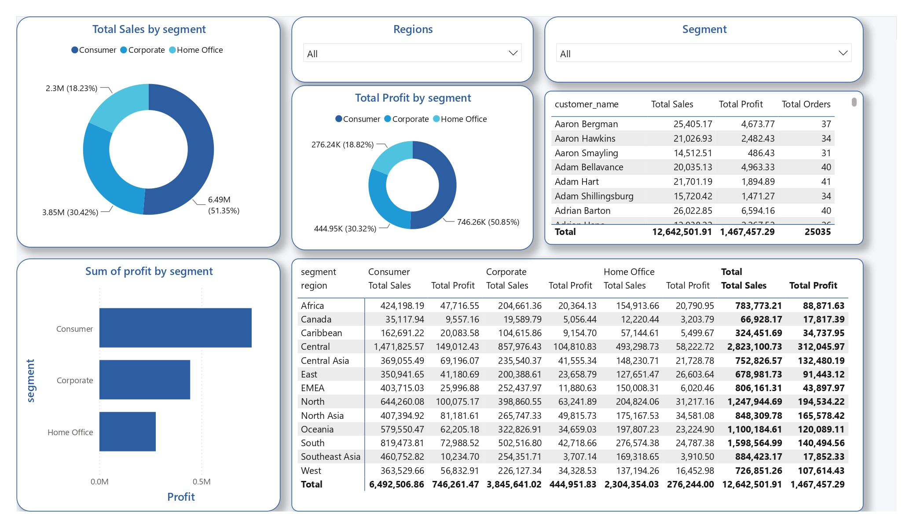
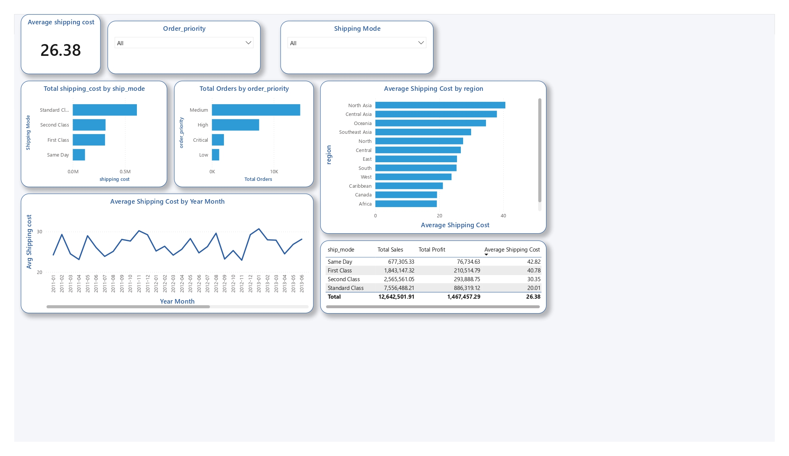

# Retail Performance & Profitability Dashboard


End-to-end retail analytics project using **Python, MySQL, and Power BI** to analyze **51K+ global transaction records**, identify revenue drivers, detect profit leakage, measure discount risk, and build an executive dashboard for commercial decision-making.



## Business Problem

Global Store has strong sales volume across multiple markets, regions, product categories, and customer segments. The business risk is that revenue growth may hide weak margins caused by discounting, product-level losses, shipping cost, and regional profitability gaps.

This project answers one practical management question:

> Where is Global Store generating profitable growth, and where is revenue being created without enough profit?

## Executive KPIs

| Metric | Value |
| --- | ---: |
| Total Sales | 12,642,501.91 |
| Total Profit | 1,467,457.29 |
| Profit Margin | 11.61% |
| Orders | 25,035 |
| Customers | 1,590 |
| Products | 10,292 |
| Transaction Rows | 51,290 |
| Date Range | 2011-01-01 to 2014-12-31 |

## Key Business Insights

- **Technology** is the strongest category by revenue and profit, generating about **4.74M in sales** and **663.78K in profit**.
- **Tables** is the clearest loss-making sub-category, generating about **757K in sales** but around **-64K in profit**.
- Orders with **no discount** produce about **25.32% margin**, while discounts above **30%** produce about **-51.27% margin**.
- **Southeast Asia** generates about **884K in sales** but only **17.9K in profit**, making it a high-sales, low-margin region.
- **Consumer** is the largest revenue segment, while **Home Office** has the strongest segment margin.

## Recommended Business Actions

| Priority | Action | Business Rationale | Expected Business Impact Scenario |
| ---: | --- | --- | --- |
| 1 | Review pricing, supplier cost, and discounting for Tables | Tables creates meaningful sales but negative profit | Reducing recurring losses in Tables could directly improve category-level margin quality |
| 2 | Add control rules for discounts above 30% | Deep discounts are linked with negative margin | Lowering excessive discount exposure could improve gross margin and reduce unprofitable sales |
| 3 | Investigate Southeast Asia margin performance | The region has high sales but weak profit quality | Improving product mix, discounting, or shipping cost could turn high revenue into stronger profit |
| 4 | Prioritize profitable Technology products | Technology combines scale with strong profit contribution | Increasing Technology share could support revenue growth without weakening margin |
| 5 | Track sales and margin together in Power BI | Revenue alone can hide profit leakage | Management can identify performance issues earlier and avoid rewarding unprofitable growth |

> Impact notes are scenario-based business estimates, not measured post-implementation results.

## Analytics Workflow



## Tools Used

| Tool | Role |
| --- | --- |
| Python | Data cleaning, transformation, feature creation, and CSV exports |
| MySQL | Relational schema, data loading, quality checks, KPI queries, and business analysis |
| Power BI | Executive dashboard pages, KPI cards, trend visuals, DAX measures, and business reporting |
| CSV / Excel | Source data handling and structured exports |
| GitHub | Project documentation and portfolio presentation |

## Database Schema

The project uses a four-table MySQL model built around customers, orders, products, and sales. The ERD below is the original implementation evidence exported from MySQL Workbench.



## Power BI Dashboard

| Asset | Location | Purpose |
| --- | --- | --- |
| Editable Power BI file | `Power_bi(dashboard).pbix` | Opens the full report in Power BI Desktop |
| Exported dashboard PDF | `dashboard/power_bi_visuals.pdf` | Quick portfolio review without opening Power BI |
| Dashboard screenshots | `assets/screenshots/` | README-ready visual proof of dashboard pages |
| DAX documentation | `dashboard/dax_measures.md` | Explains KPI, margin, loss, and time-intelligence measures |
| Dashboard build guide | `dashboard/powerbi_build_guide.md` | Explains how the dashboard can be rebuilt |
| Power BI theme | `dashboard/global_store_theme.json` | Optional professional theme file |

## Dashboard Pages

| Page | Business Purpose | Screenshot |
| --- | --- | --- |
| Executive Overview | Monitor sales, profit, margin, orders, customers, and overall performance | `assets/screenshots/dashboard_overview.png` |
| Sales Performance | Identify revenue drivers across categories, products, regions, and markets | `assets/screenshots/sales_performance_page.png` |
| Profitability Analysis | Detect margin leakage, loss-making products, and discount risk | `assets/screenshots/profit_analysis_page.png` |
| Customer Segment Analysis | Compare customer segment contribution and customer value | `assets/screenshots/customer_segment_page.png` |
| Shipping & Operations | Monitor shipping cost, ship mode, priority, and operational performance | `assets/screenshots/shipping_analysis_page.png` |

## Dashboard Preview

### Sales Performance



### Profitability Analysis



### Customer Segment Analysis



### Shipping & Operations



## Project Assets

| Asset | Location |
| --- | --- |
| MySQL Workbench ERD | `assets/schema/workbench_erd.png` |
| Cleaned data and SQL-ready tables | `data/processed/` |
| Data dictionary | `data/data_dictionary.md` |
| Python data pipeline | `scripts/` |
| SQL analysis files | `sql/` |
| Notebook analysis | `notebooks/` |
| Editable Power BI file | `Power_bi(dashboard).pbix` |
| Power BI export | `dashboard/power_bi_visuals.pdf` |
| Dashboard screenshots | `assets/screenshots/` |
| Business report | `reports/project_report.md` |
| Executive summary | `reports/executive_summary.md` |
| Business impact summary | `reports/business_impact.md` |
| SQL execution summary | `reports/sql_execution_summary.md` |
| Skills demonstrated | `docs/skills_demonstrated.md` |
| Reproducibility guide | `docs/reproducibility_guide.md` |

## Finding-to-Evidence Map

| Business Finding | Evidence File | Dashboard Page |
| --- | --- | --- |
| Technology is the strongest revenue and profit category | `sql/04_sales_analysis.sql`, `sql/05_profit_analysis.sql` | Sales Analysis, Profitability Analysis |
| Tables is the main loss-making sub-category | `sql/05_profit_analysis.sql` | Profitability Analysis |
| Discounts above 30% destroy margin | `sql/05_profit_analysis.sql` | Profitability Analysis |
| Southeast Asia has high sales but weak profit | `sql/06_customer_segment_analysis.sql` | Sales Analysis, Customer Analysis |
| Consumer drives scale while Home Office has stronger margin | `sql/06_customer_segment_analysis.sql` | Customer Analysis |
| Shipping and order priority require operational monitoring | `sql/07_shipping_analysis.sql` | Shipping & Operations |
| Monthly and quarterly patterns affect planning | `sql/08_seasonality_analysis.sql` | Executive Overview |

## Reproducibility

Detailed setup, SQL run order, expected row counts, and repository structure are documented in:

```text
docs/reproducibility_guide.md
```

Quick rebuild:

```powershell
pip install -r requirements.txt
python scripts/download_dataset.py
python scripts/prepare_data.py
```

## Data Source

Dataset: **Global Super Store Dataset**  
Kaggle: https://www.kaggle.com/datasets/apoorvaappz/global-super-store-dataset

## Limitations

- The dataset covers historical transactions from 2011 to 2014.
- The analysis is based on transaction-level retail data and does not include inventory cost, supplier contracts, marketing spend, or customer acquisition cost.
- Recommendations require operational validation before implementation.
- Impact statements are business scenarios based on available data, not measured post-implementation outcomes.

## Portfolio Positioning

This project demonstrates practical data analyst and BI analyst skills: Python data preparation, SQL business analysis, Power BI reporting, DAX measure documentation, KPI design, margin analysis, dashboard storytelling, and commercial recommendation building.

## Owner

Bilal Shafiq
