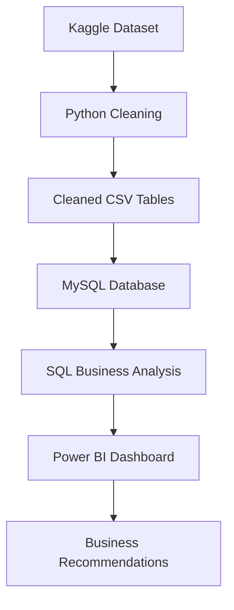

# Project Architecture

This document explains the end-to-end architecture of the Global Store Retail Performance & Profitability Analysis project.

## Architecture Diagram

## Architecture Explanation

| Layer | Tool / Asset | Purpose |
| --- | --- | --- |
| Data Source | Kaggle Global Super Store Dataset | Provides raw retail transaction data. |
| Data Preparation | Python / Pandas | Cleans data, standardizes fields, creates derived columns, and exports processed files. |
| Processed Data | CSV Tables | Stores cleaned transaction data and SQL-ready dimension/fact tables. |
| Database Layer | MySQL | Stores structured tables for customers, orders, products, and sales. |
| Analysis Layer | SQL | Calculates KPIs and investigates sales, profit, discounts, customer segments, shipping, and seasonality. |
| Reporting Layer | Power BI | Presents executive dashboards and interactive visual analysis. |
| Decision Layer | Reports and Recommendations | Converts analytical findings into business actions. |

## Data Flow

1. The raw dataset is downloaded from Kaggle.
2. Python standardizes the data and prepares clean CSV outputs.
3. Cleaned CSV files are loaded into MySQL.
4. SQL queries validate the data and produce business analysis outputs.
5. Power BI uses the processed data and DAX measures to build dashboard pages.
6. Reports summarize findings and recommend business actions.

## Why This Architecture Is Industry-Relevant

This workflow mirrors a practical business intelligence process:

- raw data is prepared before reporting
- data is structured into relational tables
- SQL is used for repeatable business logic
- Power BI communicates insights visually
- recommendations are tied back to evidence

The architecture demonstrates that the project is not only a dashboard, but a complete analytics workflow from data source to business decision.
