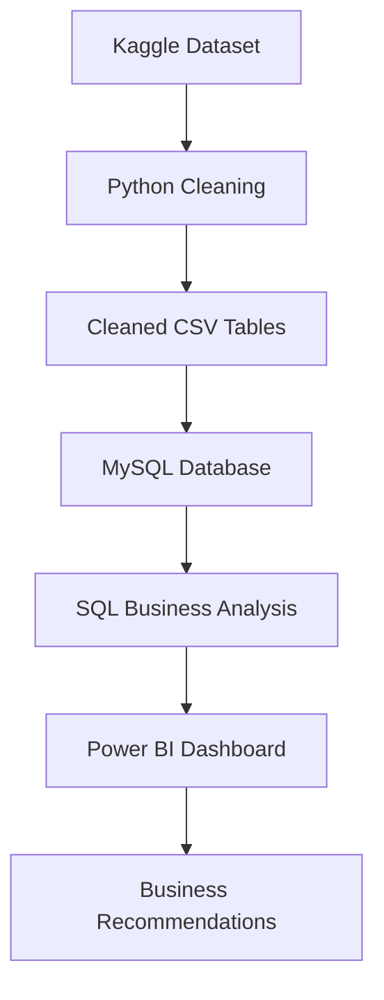

# Global Store Retail Performance Report

## Executive View

Global Store generated **12.64M in sales** and **1.47M in profit** across **51,290 transaction rows**, **25,035 orders**, **1,590 customers**, and **10,292 products**. The overall profit margin is **11.61%**.

The main business issue is not lack of sales. The risk is that parts of the business generate revenue without enough profit. The clearest examples are the **Tables** sub-category, aggressive discounting above 30%, and weak regional margin in **Southeast Asia**.

## Business Questions Answered

| Area | Question |
| --- | --- |
| Executive KPIs | What are total sales, profit, orders, customers, quantity, and margin? |
| Sales | Which categories, products, regions, and markets generate the most revenue? |
| Profit | Which products and sub-categories create margin leakage? |
| Discounting | How does discount level affect profit margin? |
| Customers | Which segments and customers contribute most to revenue and profit? |
| Shipping | Which ship modes and priorities carry the highest cost? |
| Seasonality | Which months and quarters show stronger sales and profit patterns? |

## Data Foundation

Source dataset: **Global Super Store Dataset**  
Kaggle URL: https://www.kaggle.com/datasets/apoorvaappz/global-super-store-dataset

| Data Asset | File |
| --- | --- |
| Raw source file | `data/raw/global_superstore_raw.csv` |
| Cleaned transaction file | `data/processed/global_superstore_cleaned.csv` |
| Customer table | `data/processed/customers.csv` |
| Product table | `data/processed/products.csv` |
| Order table | `data/processed/orders.csv` |
| Sales table | `data/processed/sales.csv` |

## Delivery Workflow

This solution follows a practical business intelligence workflow:

## Python Data Preparation

Python handles the data preparation layer:

- Standardizes column names.
- Converts `Order_Date` and `Ship_Date` into date fields.
- Converts sales, profit, discount, quantity, shipping cost, and postal code into numeric fields.
- Adds `Shipping_Days`, `Year`, `Month`, `Quarter`, and `Profit_Margin`.
- Exports a cleaned transaction file and four MySQL-ready CSV tables.

Key files:

| File | Role |
| --- | --- |
| `scripts/download_dataset.py` | Downloads the Kaggle dataset |
| `scripts/prepare_data.py` | Builds cleaned and SQL-ready files |
| `notebooks/02_data_cleaning_and_preparation.ipynb` | Shows the cleaning workflow |
| `data/data_dictionary.md` | Defines the dataset fields |

## SQL Database Layer

The MySQL model uses four core tables:

| Table | Role |
| --- | --- |
| `customers` | Customer profile and segment |
| `products` | Product hierarchy |
| `orders` | Dates, shipping, priority, market, and region |
| `sales` | Revenue, quantity, discount, profit, and shipping cost |

Expected row counts:

| Table | Rows |
| --- | ---: |
| `customers` | 1,590 |
| `products` | 10,292 |
| `orders` | 25,035 |
| `sales` | 51,290 |

SQL files:

| Script | Business Output |
| --- | --- |
| `01_database_schema.sql` | Database structure |
| `00_load_data_notes.sql` | Data loading and row count validation |
| `02_data_cleaning.sql` | Quality checks and joined analysis view |
| `03_kpi_queries.sql` | Executive KPIs |
| `04_sales_analysis.sql` | Sales drivers |
| `05_profit_analysis.sql` | Margin leakage and discount impact |
| `06_customer_segment_analysis.sql` | Segment and customer performance |
| `07_shipping_analysis.sql` | Shipping and operational cost checks |
| `08_seasonality_analysis.sql` | Month and quarter trends |

## Power BI Reporting Layer

Power BI turns the SQL/Python outputs into management views.

| Page | Business Use |
| --- | --- |
| Executive Overview | High-level sales, profit, margin, orders, quantity, and trend monitoring |
| Sales Analysis | Product, category, region, market, and monthly sales performance |
| Profitability Analysis | Profit margin, loss-making products, and discount impact |
| Customer Analysis | Segment contribution, top customers, and region-segment performance |
| Shipping & Operations | Ship mode cost, delivery days, order priority, and shipping impact |

Dashboard assets:

| Asset | File |
| --- | --- |
| Editable Power BI report | `Power_bi(dashboard).pbix` |
| Exported dashboard PDF | `dashboard/power_bi_visuals.pdf` |
| DAX documentation | `dashboard/dax_measures.md` |
| Dashboard screenshots | `assets/screenshots/` |

## Findings

### 1. Sales Scale Is Strong, but Margin Needs Control

Global Store produced **12.64M in sales** and **1.47M in profit**, with an overall margin of **11.61%**. The business has meaningful sales volume, but profit varies sharply by product group, discount level, and region.

### 2. Technology Is the Strongest Category

Technology generated about **4.74M in sales** and **663.78K in profit**, making it the strongest category by both revenue and profit contribution.

### 3. Furniture Needs Margin Review

Furniture generated about **4.11M in sales** but only **285.20K in profit**, giving it a much weaker margin profile than Technology and Office Supplies.

### 4. Tables Is the Main Loss-Making Sub-Category

Tables generated about **757K in sales** but **-64K in profit**. This is the clearest product-level issue in the dataset and needs review across pricing, discounting, supplier cost, and shipping cost.

### 5. Deep Discounts Destroy Profit

No-discount orders produce about **25.32%** margin. Orders discounted above 30% produce about **-51.27%** margin. This is the strongest evidence that discount policy needs tighter control.

### 6. Southeast Asia Has High Sales but Weak Profitability

Southeast Asia generated about **884K in sales** but only **17.9K in profit**, with margin near **2.02%**. Future sales growth in this region needs a margin improvement plan.

### 7. Customer Segments Are Balanced, with Different Roles

Consumer customers generate the most revenue. Home Office has the strongest margin. This creates two separate plays: Consumer for scale and Home Office for margin-focused growth.

## Business Actions

| Priority | Action | Expected Impact |
| ---: | --- | --- |
| 1 | Review Tables pricing, discounting, supplier cost, and shipping cost | Stop recurring loss from a high-sales sub-category |
| 2 | Add control rules for discounts above 30% | Reduce margin erosion |
| 3 | Investigate Southeast Asia product mix, discounting, and shipping cost | Improve regional profit quality |
| 4 | Push profitable Technology products through targeted campaigns | Grow revenue without weakening margin |
| 5 | Build segment campaigns around Consumer scale and Home Office margin | Improve customer value and retention |
| 6 | Keep Power BI KPI monitoring active for sales, profit, and margin | Make performance issues visible earlier |

## Deliverables

| Deliverable | Location |
| --- | --- |
| Cleaned data | `data/processed/` |
| MySQL scripts | `sql/` |
| Power BI dashboard | `Power_bi(dashboard).pbix` |
| Dashboard PDF | `dashboard/power_bi_visuals.pdf` |
| Dashboard screenshots | `assets/screenshots/` |
| DAX measures | `dashboard/dax_measures.md` |
| Business impact summary | `reports/business_impact.md` |
| Skills demonstrated | `docs/skills_demonstrated.md` |

## Caveats

- The dataset covers 2011-2014 transactions.
- The dataset source and usage terms belong to the Kaggle dataset owner.
- The analysis does not include inventory cost, supplier contracts, marketing spend, or customer acquisition cost.
- Impact statements are business scenarios based on available data, not measured post-implementation outcomes.
