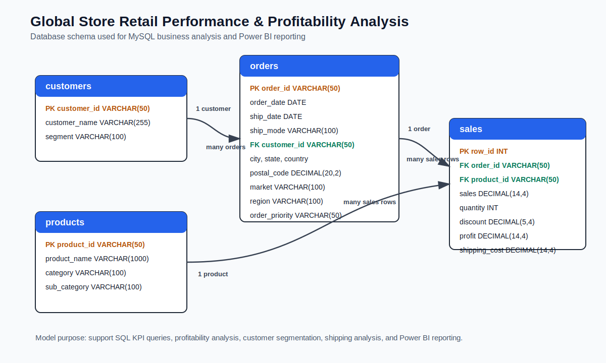

# SQL Workflow

This folder contains the MySQL scripts for the **Global Store Retail Performance & Profitability Analysis** database and business queries.

## Database Schema

The SQL layer uses a four-table relational model with `customers`, `orders`, `products`, and `sales`.

### MySQL Workbench ERD

This is the original ERD exported from MySQL Workbench and should be treated as the implementation evidence for the database model.

### Clean Documentation ERD

A simplified documentation version is also stored in this SQL folder for quick reference:

## Table Relationships

| Relationship | Meaning |
| --- | --- |
| `customers.customer_id` -> `orders.customer_id` | One customer can place many orders |
| `orders.order_id` -> `sales.order_id` | One order can contain many sales rows |
| `products.product_id` -> `sales.product_id` | One product can appear in many sales rows |

## Run Order

| Step | Script | Output |
| ---: | --- | --- |
| 1 | `01_database_schema.sql` | Creates the `global_store` database and relational tables |
| 2 | `00_load_data_notes.sql` | Loads processed CSV files and returns table row counts |
| 3 | `02_data_cleaning.sql` | Runs quality checks and creates `vw_global_store_analysis` |
| 4 | `03_kpi_queries.sql` | Calculates executive KPIs |
| 5 | `04_sales_analysis.sql` | Returns sales drivers by product, category, region, market, and month |
| 6 | `05_profit_analysis.sql` | Returns profit leakage, loss-making products, and discount impact |
| 7 | `06_customer_segment_analysis.sql` | Returns segment, customer, and market performance |
| 8 | `07_shipping_analysis.sql` | Returns shipping cost, order priority, and delivery-day outputs |
| 9 | `08_seasonality_analysis.sql` | Returns month and quarter trends |

## MySQL Workbench Flow

1. Open MySQL Workbench.
2. Run `01_database_schema.sql`.
3. Run `00_load_data_notes.sql`.
4. Confirm row counts:

| Table | Rows |
| --- | ---: |
| `customers` | 1,590 |
| `products` | 10,292 |
| `orders` | 25,035 |
| `sales` | 51,290 |

5. Run analysis files from `02_data_cleaning.sql` to `08_seasonality_analysis.sql`.
6. Save Workbench output screenshots under `assets/screenshots/sql/`.

## Main View

`vw_global_store_analysis` is created in `02_data_cleaning.sql`. It joins customers, orders, products, and sales into one reporting view with:

- order dates and shipping days
- customer segment
- product hierarchy
- region and market
- sales, quantity, discount, profit, and shipping cost
- profit margin

## Screenshot Outputs

| Screenshot Folder | Related Script |
| --- | --- |
| `assets/screenshots/sql/02_data_cleaning/` | `02_data_cleaning.sql` |
| `assets/screenshots/sql/03_kpi_queries/` | `03_kpi_queries.sql` |
| `assets/screenshots/sql/04_sales_analysis/` | `04_sales_analysis.sql` |
| `assets/screenshots/sql/05_profit_analysis/` | `05_profit_analysis.sql` |
| `assets/screenshots/sql/06_customer_segment_analysis/` | `06_customer_segment_analysis.sql` |
| `assets/screenshots/sql/07_shipping_analysis/` | `07_shipping_analysis.sql` |
| `assets/screenshots/sql/08_seasonality_analysis/` | `08_seasonality_analysis.sql` |
